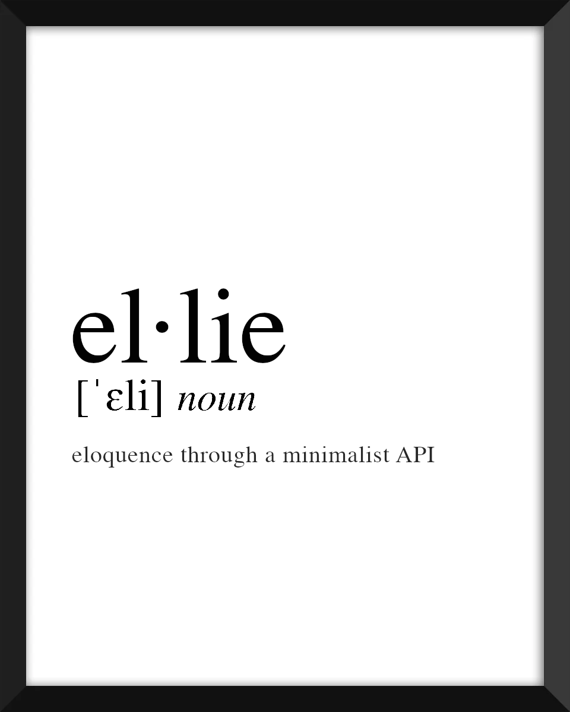

</img>

  

  

    <ul>
      
<h1 style="display: inline-block;">Why?</h1>

    </ul>
    Ellie is a voice assistant built to let you <i>speak naturally</i>. Despite its flexibility, Ellie has a deceptively simple API to keep your sanity intact <i>(and maybe even save those last few hairs!)</i>
      
    <h3>
      <a href="#quick-start">Quick Start</a> &nbsp-&nbsp <a href="#documentation">Documentation</a>
    </h3>
  

